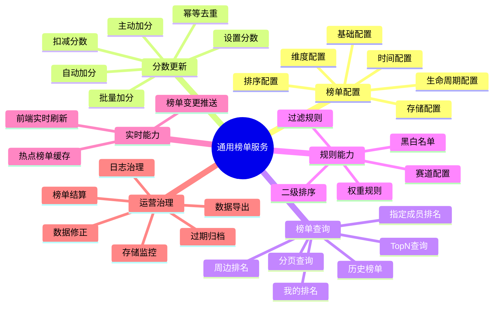
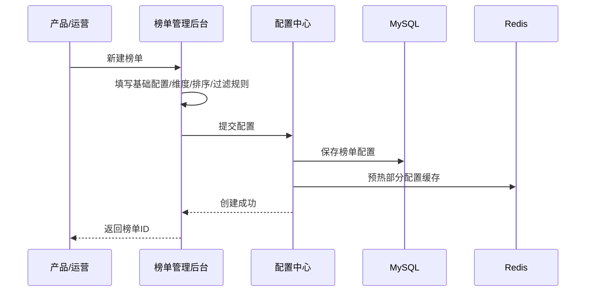
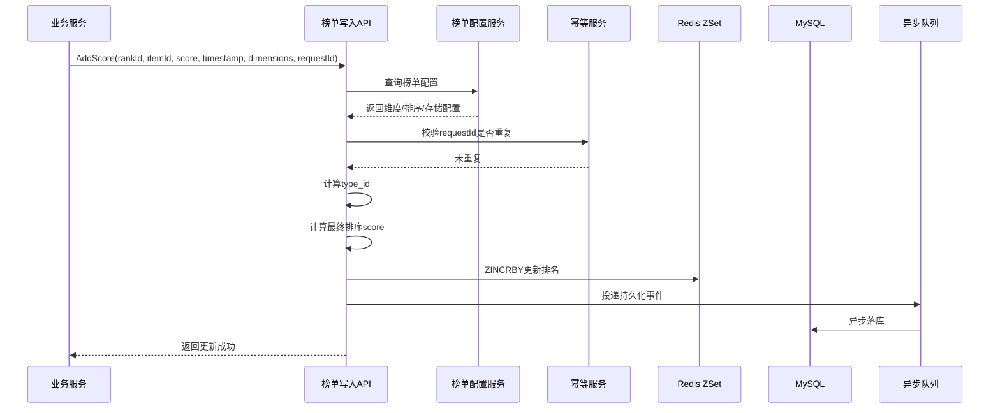
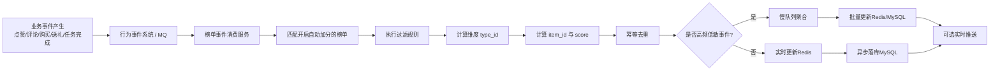
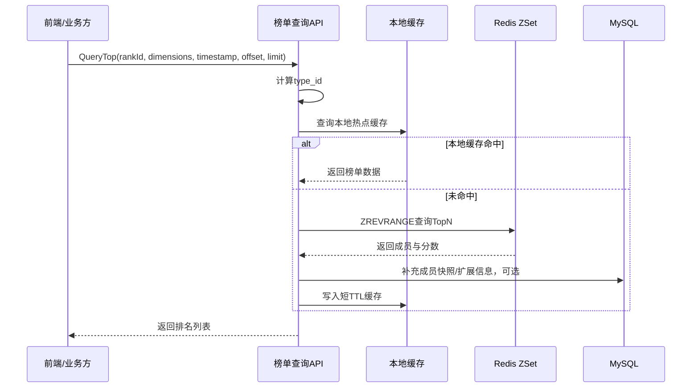
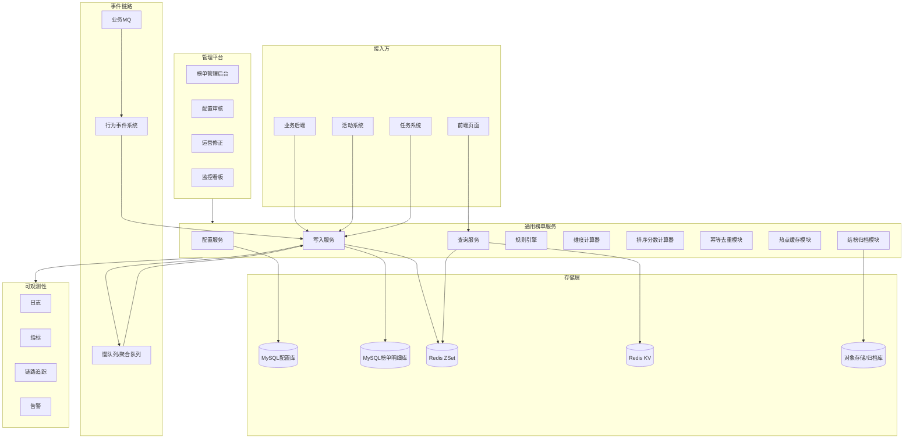
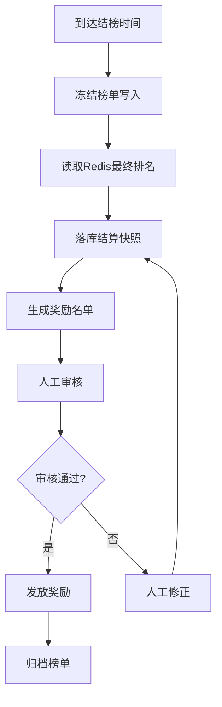
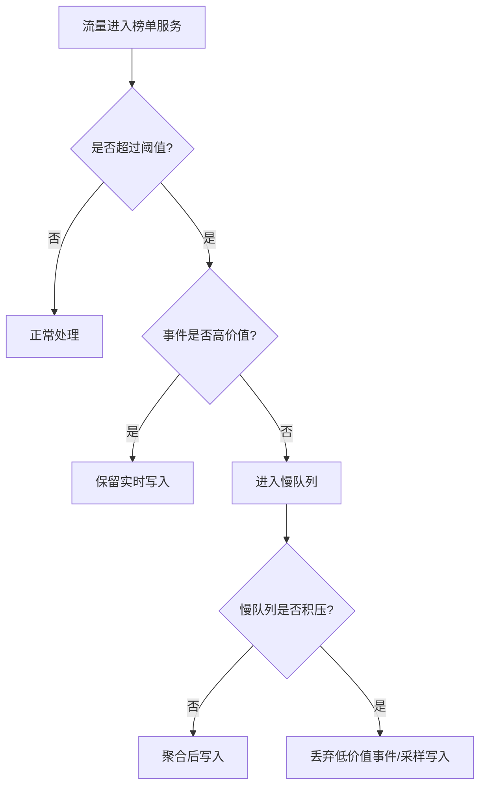

下面把这篇 B 站技术博客抽象成一份**《通用榜单服务》产品原型与宏观技术设计方案文档**。原文核心是“直播通用榜单系统”，但我们去掉强直播业务绑定，把它沉淀成适用于**社区内容、直播、电商活动、游戏、创作者平台、积分激励、任务活动**等场景的通用榜单能力。

---

# 《通用榜单服务》产品原型与宏观技术设计方案

## 1. 背景与目标

在社区内容、直播互动、活动运营、游戏竞技、创作者激励等业务中，榜单是一种非常常见的产品能力。它可以用于展示用户、内容、主播、房间、商品、队伍、组织、话题等对象的排名，帮助平台完成激励、曝光、竞争、荣誉、结算等目标。

参考 B 站直播榜单系统的实践，榜单可能覆盖主播榜、用户榜、道具榜、房间榜、公会榜等多种对象类型，也可能按全站、分区、活动赛季、直播场次等不同范围竞争，还可能按长期、季度、月、周、日、小时等不同时间粒度结榜。([bilibili.com][1])

因此，通用榜单服务的核心目标不是“做一个固定排行榜”，而是建设一个**可配置、可扩展、可复用、高性能、可运营治理**的基础服务。

---

## 2. 产品定位

### 2.1 产品名称

**通用榜单服务**

也可以叫：

* Ranking Service
* Leaderboard Platform
* 榜单中台
* 排行榜基础服务

### 2.2 产品定位

通用榜单服务是面向多个业务场景的**榜单配置、分数更新、排名查询、结算统计、数据治理基础平台**。

它向业务方提供：

1. **管理后台**：配置榜单规则、维度、排序、过滤、生命周期、降级策略。
2. **写入接口**：业务主动加分、扣分、设置分数、批量更新。
3. **事件接入**：消费业务事件，自动触发榜单更新。
4. **查询接口**：查询榜单 TopN、我的排名、指定成员排名、榜单详情。
5. **实时推送**：榜单变更后推送给前端或长连接系统。
6. **运营治理**：存储监控、热点监控、日志治理、过期归档、异常告警。

---

## 3. 适用场景

### 3.1 社区内容场景

| 场景   | 榜单示例               |
| ---- | ------------------ |
| 内容热度 | 文章热度榜、视频热度榜、帖子热度榜  |
| 用户贡献 | 创作者贡献榜、活跃用户榜、评论达人榜 |
| 互动行为 | 点赞榜、收藏榜、评论榜、转发榜    |
| 活动运营 | 活动积分榜、打卡榜、任务完成榜    |
| 圈子社区 | 小组人气榜、话题热度榜、圈子贡献榜  |

### 3.2 直播 / 娱乐场景

| 场景    | 榜单示例          |
| ----- | ------------- |
| 主播激励  | 主播人气榜、主播收入榜   |
| 用户消费  | 用户贡献榜、守护榜、礼物榜 |
| 直播间互动 | 弹幕榜、点赞榜、观看时长榜 |
| 活动 PK | 活动赛季榜、阵营榜、房间榜 |

### 3.3 电商 / 交易场景

| 场景   | 榜单示例          |
| ---- | ------------- |
| 商品运营 | 商品销量榜、热销榜、收藏榜 |
| 商家运营 | 商家成交榜、店铺人气榜   |
| 活动促销 | 秒杀榜、预售榜、拼团榜   |

### 3.4 游戏 / 任务场景

| 场景   | 榜单示例        |
| ---- | ----------- |
| 玩家排行 | 战力榜、等级榜、积分榜 |
| 赛季活动 | 赛季榜、段位榜、阵营榜 |
| 任务系统 | 任务积分榜、贡献榜   |

---

# 4. 产品原型设计

## 4.1 核心用户角色

| 角色   | 主要诉求               |
| ---- | ------------------ |
| 业务产品 | 快速创建榜单，配置规则，上线活动   |
| 业务研发 | 通过统一 API 接入榜单能力    |
| 运营人员 | 查看榜单效果，手动干预，导出结算数据 |
| 平台研发 | 保障榜单服务稳定性、性能、容量、治理 |
| 终端用户 | 查看排名、自己的名次、榜单奖励    |

---

## 4.2 产品功能地图



---

# 5. 页面原型设计

## 5.1 榜单管理页

### 页面目标

用于查看系统中所有榜单，支持搜索、筛选、创建、编辑、上下线、复制榜单。

### 页面布局

```text
┌──────────────────────────────────────────────────────────────┐
│ 通用榜单服务 / 榜单管理                                      │
├──────────────────────────────────────────────────────────────┤
│ 榜单名称 [________]  榜单ID [____]  状态 [全部 v]  业务线 [v] │
│ [查询] [重置]                                    [+ 新建榜单] │
├──────────────────────────────────────────────────────────────┤
│ 榜单ID │ 榜单名称 │ 业务线 │ 榜单对象 │ 时间粒度 │ 状态 │ 操作 │
│ 10001 │ 创作者月榜 │ 内容社区 │ 用户 │ 月榜 │ 已上线 │ 编辑 详情 │
│ 10002 │ 视频热度日榜 │ 内容社区 │ 内容 │ 日榜 │ 已上线 │ 编辑 详情 │
│ 10003 │ 活动积分榜 │ 活动中心 │ 用户 │ 活动周期 │ 草稿 │ 编辑 上线 │
└──────────────────────────────────────────────────────────────┘
```

### 核心字段

| 字段    | 说明                |
| ----- | ----------------- |
| 榜单 ID | 系统自动生成，接口调用时使用    |
| 榜单名称  | 业务可读名称            |
| 业务线   | 所属业务域             |
| 榜单对象  | 用户、内容、房间、商品、组织等   |
| 时间粒度  | 无、小时、天、周、月、季度、赛季  |
| 状态    | 草稿、已上线、已下线、已归档    |
| 操作    | 编辑、复制、详情、上线、下线、归档 |

原文中也强调，榜单 ID 是榜单系统中的关键标识，后续数据读取和更新都需要指定榜单 ID。([bilibili.com][1])

---

## 5.2 新建榜单页

### 页面目标

通过配置化方式快速创建一个新榜单。

### 页面结构

```text
┌──────────────────────────────────────────────┐
│ 新建榜单                                      │
├──────────────────────────────────────────────┤
│ 1. 基础信息                                   │
│ 榜单名称：[____________________]              │
│ 业务线：[内容社区 v]                          │
│ 榜单对象：[用户 v]                            │
│ 榜单描述：[____________________]              │
│                                                │
│ 2. 排序配置                                   │
│ 分数类型：[累计分 v]                          │
│ 排序方向：[分数越高越靠前 v]                  │
│ 同分排序：[先达到分数者优先 v]                │
│ 是否允许负分：[否 v]                          │
│                                                │
│ 3. 时间配置                                   │
│ 榜单周期：[自然月 v]                          │
│ 积分开始时间：[2026-07-01 00:00:00]           │
│ 积分结束时间：[2026-07-31 23:59:59]           │
│ 结榜方式：[自动结榜 v]                        │
│                                                │
│ 4. 存储配置                                   │
│ Redis集群：[ranking-redis-01 v]               │
│ MySQL集群：[ranking-mysql-01 v]               │
│ 榜单最大长度：[10000]                         │
│ 缓存TTL：[86400秒]                            │
│                                                │
│ [保存草稿] [保存并上线]                       │
└──────────────────────────────────────────────┘
```

---

## 5.3 维度配置页

### 页面目标

配置一个榜单如何被拆分成多个子榜。

例如：

* 全站一个榜
* 每个作者一个榜
* 每个活动一个榜
* 每个分区一个榜
* 每个活动 + 每个赛道一个榜
* 每个主播 + 每场直播一个榜

原文中提到，维度配置会影响榜单是否横向分榜；时间维度会让榜单按自然时间纵向分榜，例如每天 0 点自动切换到新一天榜单。([bilibili.com][1])

### 页面布局

```text
┌──────────────────────────────────────────────┐
│ 榜单维度配置                                  │
├──────────────────────────────────────────────┤
│ 横向维度                                      │
│ [ ] 全站榜                                    │
│ [x] 业务线 business_id                        │
│ [x] 分区 category_id                          │
│ [ ] 作者 author_id                            │
│ [ ] 内容 content_id                           │
│ [x] 活动 activity_id                          │
│ [x] 自定义维度 ext_dimension                  │
│                                                │
│ 纵向时间维度                                  │
│ 时间粒度：[自然日 v]                          │
│ 时间锚点：[行为发生时间 v]                    │
│                                                │
│ type_id 生成预览：                            │
│ {time_bucket}_{business_id}_{category_id}_{activity_id}_{ext} │
│                                                │
│ [保存配置]                                    │
└──────────────────────────────────────────────┘
```

### 设计说明

榜单实例可以用：

```text
rank_id + type_id
```

唯一标识。

其中：

| 字段      | 说明                          |
| ------- | --------------------------- |
| rank_id | 榜单配置 ID                     |
| type_id | 子榜维度 ID，由时间维度和业务维度拼接生成      |
| item_id | 上榜对象 ID，例如用户 ID、内容 ID、商品 ID |
| score   | 业务真实分数                      |
| rank    | 当前排名                        |

---

## 5.4 自动加分配置页

### 页面目标

让榜单可以订阅业务事件，自动完成积分更新。

例如：

* 用户点赞内容，内容热度榜 +1
* 用户评论内容，内容热度榜 +3
* 用户完成任务，活动积分榜 +10
* 用户购买商品，商品销量榜 +1
* 用户送礼，主播贡献榜 +礼物价值

原文中提到，B 站直播榜单通过行为系统统一消费上游消息，然后调用下游业务方 RPC 接口进行事件投递；榜单服务作为行为系统下游，当行为事件发生时，事件会扇出到打开对应开关的榜单。([bilibili.com][1])

### 页面布局

```text
┌──────────────────────────────────────────────┐
│ 自动加分配置                                  │
├──────────────────────────────────────────────┤
│ 事件来源：[社区行为系统 v]                    │
│ 事件类型：[content.like v]                    │
│ 是否开启：[开启]                              │
│                                                │
│ 加分对象映射                                  │
│ item_id 来源：[content_id v]                  │
│ 用户ID 来源：[user_id v]                      │
│ 时间戳来源：[event_time v]                    │
│                                                │
│ 分数规则                                      │
│ 固定加分：[1]                                 │
│ 或表达式：[like_count * 1 + comment_count * 3]│
│                                                │
│ 幂等配置                                      │
│ 幂等键：[event_id v]                          │
│ 重复事件处理：[忽略 v]                        │
│                                                │
│ [保存] [测试事件]                             │
└──────────────────────────────────────────────┘
```

---

## 5.5 过滤规则配置页

### 页面目标

配置什么样的事件可以给榜单加分，什么样的事件需要跳过。

原文中提到，榜单系统支持一级、二级分区过滤、商品过滤，以及特殊业务加分 Hook，不过特殊业务 Hook 会导致通用链路耦合业务逻辑，后续不推荐常规业务使用。([bilibili.com][1])

### 页面布局

```text
┌──────────────────────────────────────────────┐
│ 过滤规则配置                                  │
├──────────────────────────────────────────────┤
│ 分区过滤                                      │
│ 一级分区：[科技区, 游戏区]                    │
│ 二级分区：[后端开发, 前端开发]                │
│ 过滤模式：[仅命中才加分 v]                    │
│                                                │
│ 对象过滤                                      │
│ 内容类型：[文章, 视频]                        │
│ 商品ID白名单：[1001,1002,1003]                │
│ 用户黑名单：[导入文件]                        │
│                                                │
│ 风控过滤                                      │
│ 是否过滤异常用户：[是]                        │
│ 是否过滤作弊行为：[是]                        │
│                                                │
│ [保存]                                        │
└──────────────────────────────────────────────┘
```

---

## 5.6 榜单详情页

### 页面目标

展示某个榜单的当前运行状态、配置、实时排名、存储用量、读写 QPS、异常情况。

### 页面布局

```text
┌──────────────────────────────────────────────────────────────┐
│ 榜单详情：创作者月度贡献榜                                    │
├──────────────────────────────────────────────────────────────┤
│ 榜单ID：10001  状态：已上线  时间粒度：自然月  最大长度：10000 │
│ 当前子榜：2026-06-01_community_tech                          │
├──────────────────────────────────────────────────────────────┤
│ 实时概览                                                      │
│ 写入QPS：356    读取QPS：12890    Redis命中率：98.7%           │
│ 今日加分事件：1,982,321    当前成员数：9,812                  │
├──────────────────────────────────────────────────────────────┤
│ 排名 │ 成员ID │ 昵称 │ 分数 │ 排名变化 │ 最后更新时间          │
│ 1    │ 10086  │ 用户A │ 98210 │ ↑2      │ 2026-06-30 20:10:01 │
│ 2    │ 10010  │ 用户B │ 88011 │ ↓1      │ 2026-06-30 20:09:31 │
│ 3    │ 10011  │ 用户C │ 76230 │ -       │ 2026-06-30 20:09:10 │
├──────────────────────────────────────────────────────────────┤
│ [导出数据] [刷新] [手动修正] [查看日志] [查看监控]             │
└──────────────────────────────────────────────────────────────┘
```

---

# 6. 核心业务流程

## 6.1 创建榜单流程



---

## 6.2 主动加分流程

业务系统自己计算好分数，然后调用榜单服务更新。



---

## 6.3 自动加分流程

业务事件进入行为系统或消息队列，榜单服务根据配置自动更新多个榜单。



原文对高频互动事件也使用了类似思路：对于持续观播、点赞、弹幕等海量行为，会引入“慢队列”，先聚合同维度写入，再批量更新存储，以降低 Redis 和 MySQL 压力。([bilibili.com][1])

---

## 6.4 榜单查询流程



原文中提到，榜单读取流量大多打到 Redis；对于热门直播间或热点 zset key，可以增加二级内存缓存来降低 Redis 单节点压力，但会牺牲一定实时性。([bilibili.com][1])

---

# 7. 技术架构设计

## 7.1 总体架构



---

## 7.2 核心模块职责

| 模块      | 职责                               |
| ------- | -------------------------------- |
| 配置服务    | 管理榜单基础配置、维度配置、排序配置、过滤规则、存储配置     |
| 写入服务    | 提供加分、扣分、设置分数、批量更新等能力             |
| 查询服务    | 提供 TopN、分页、我的排名、周边排名、历史榜单查询      |
| 规则引擎    | 执行过滤规则、黑白名单、业务条件判断               |
| 维度计算器   | 根据榜单配置和请求参数生成 type_id            |
| 排序分数计算器 | 将业务分数和二级排序信息转换成 Redis ZSet score |
| 幂等模块    | 防止 MQ 重复消费、接口重试导致重复加分            |
| 慢队列聚合模块 | 对高频低敏事件进行聚合写入                    |
| 热点缓存模块  | 对热点榜单进行本地缓存，降低 Redis 压力          |
| 结榜归档模块  | 处理榜单结算、数据归档、过期清理                 |
| 监控告警模块  | 监控 QPS、延迟、错误率、热点 key、大 key、积压等   |

---

# 8. 数据模型设计

## 8.1 榜单配置表 rank_config

```sql
CREATE TABLE rank_config (
    id BIGINT PRIMARY KEY AUTO_INCREMENT COMMENT '主键ID',
    rank_id BIGINT NOT NULL UNIQUE COMMENT '榜单ID',
    rank_name VARCHAR(128) NOT NULL COMMENT '榜单名称',
    biz_code VARCHAR(64) NOT NULL COMMENT '业务线编码',
    target_type VARCHAR(32) NOT NULL COMMENT '上榜对象类型:user/content/room/product/org',
    status TINYINT NOT NULL DEFAULT 0 COMMENT '状态:0草稿,1上线,2下线,3归档',
    sort_type VARCHAR(32) NOT NULL COMMENT '排序类型:score_desc/score_asc',
    same_score_policy VARCHAR(32) NOT NULL COMMENT '同分排序策略',
    score_integer_digits INT NOT NULL DEFAULT 12 COMMENT '真实分数整数位数',
    max_rank_size INT NOT NULL DEFAULT 10000 COMMENT '榜单最大长度',
    redis_cluster VARCHAR(64) NOT NULL COMMENT 'Redis集群标识',
    mysql_cluster VARCHAR(64) NOT NULL COMMENT 'MySQL集群标识',
    cache_ttl_seconds INT NOT NULL DEFAULT 3600 COMMENT '缓存TTL',
    start_time DATETIME DEFAULT NULL COMMENT '积分开始时间',
    end_time DATETIME DEFAULT NULL COMMENT '积分结束时间',
    created_at DATETIME NOT NULL,
    updated_at DATETIME NOT NULL
) COMMENT='榜单基础配置表';
```

---

## 8.2 榜单维度配置表 rank_dimension_config

```sql
CREATE TABLE rank_dimension_config (
    id BIGINT PRIMARY KEY AUTO_INCREMENT COMMENT '主键ID',
    rank_id BIGINT NOT NULL COMMENT '榜单ID',
    dimension_name VARCHAR(64) NOT NULL COMMENT '维度名称',
    dimension_field VARCHAR(64) NOT NULL COMMENT '维度字段',
    dimension_order INT NOT NULL COMMENT '拼接顺序',
    required TINYINT NOT NULL DEFAULT 1 COMMENT '是否必填',
    created_at DATETIME NOT NULL,
    updated_at DATETIME NOT NULL,
    KEY idx_rank_id (rank_id)
) COMMENT='榜单维度配置表';
```

---

## 8.3 榜单时间配置表 rank_time_config

```sql
CREATE TABLE rank_time_config (
    id BIGINT PRIMARY KEY AUTO_INCREMENT COMMENT '主键ID',
    rank_id BIGINT NOT NULL COMMENT '榜单ID',
    time_type VARCHAR(32) NOT NULL COMMENT '时间粒度:none/hour/day/week/month/season/custom',
    timezone VARCHAR(64) NOT NULL DEFAULT 'Asia/Shanghai' COMMENT '时区',
    anchor_type VARCHAR(32) NOT NULL COMMENT '时间锚点:event_time/request_time',
    created_at DATETIME NOT NULL,
    updated_at DATETIME NOT NULL,
    UNIQUE KEY uk_rank_id (rank_id)
) COMMENT='榜单时间维度配置表';
```

---

## 8.4 榜单成员分数表 rank_member_score

```sql
CREATE TABLE rank_member_score (
    id BIGINT PRIMARY KEY AUTO_INCREMENT COMMENT '主键ID',
    rank_id BIGINT NOT NULL COMMENT '榜单ID',
    type_id VARCHAR(256) NOT NULL COMMENT '子榜维度ID',
    item_id VARCHAR(128) NOT NULL COMMENT '上榜对象ID',
    score BIGINT NOT NULL DEFAULT 0 COMMENT '业务真实分数',
    sub_score BIGINT NOT NULL DEFAULT 0 COMMENT '二级排序分',
    final_score DECIMAL(32, 8) NOT NULL COMMENT '最终排序分',
    rank_no INT DEFAULT NULL COMMENT '当前排名，可异步刷新',
    last_event_time DATETIME DEFAULT NULL COMMENT '最后一次加分事件时间',
    created_at DATETIME NOT NULL,
    updated_at DATETIME NOT NULL,
    UNIQUE KEY uk_rank_type_item (rank_id, type_id, item_id),
    KEY idx_rank_type_score (rank_id, type_id, score)
) COMMENT='榜单成员分数表';
```

---

## 8.5 幂等记录表 rank_idempotent_record

```sql
CREATE TABLE rank_idempotent_record (
    id BIGINT PRIMARY KEY AUTO_INCREMENT COMMENT '主键ID',
    rank_id BIGINT NOT NULL COMMENT '榜单ID',
    request_id VARCHAR(128) NOT NULL COMMENT '幂等请求ID或事件ID',
    item_id VARCHAR(128) NOT NULL COMMENT '上榜对象ID',
    type_id VARCHAR(256) NOT NULL COMMENT '子榜维度ID',
    status TINYINT NOT NULL DEFAULT 1 COMMENT '状态:1成功,2失败',
    created_at DATETIME NOT NULL,
    UNIQUE KEY uk_rank_request (rank_id, request_id)
) COMMENT='榜单幂等记录表';
```

---

# 9. Redis Key 设计

## 9.1 榜单 ZSet

```text
rank:zset:{rank_id}:{type_id}
```

示例：

```text
rank:zset:10001:1719763200_community_tech
```

用途：

* 存储榜单成员排名
* member = item_id
* score = final_score

---

## 9.2 成员分数 KV

```text
rank:member:{rank_id}:{type_id}:{item_id}
```

用途：

* 缓存成员分数详情
* 包含真实分、二级分、最后更新时间、扩展字段

---

## 9.3 榜单配置缓存

```text
rank:config:{rank_id}
```

用途：

* 缓存榜单配置
* 降低 MySQL 配置读取压力

---

## 9.4 幂等 Key

```text
rank:idem:{rank_id}:{request_id}
```

用途：

* 防止重复加分
* TTL 根据业务事件重放周期设置

---

## 9.5 热点榜单本地缓存标识

```text
rank:hot:{rank_id}:{type_id}
```

用途：

* 标记热点榜单
* 查询服务可将其加载到本地缓存

---

# 10. API 设计

## 10.1 创建榜单

```http
POST /api/ranks
```

请求体：

```json
{
  "rankName": "创作者月度贡献榜",
  "bizCode": "content_community",
  "targetType": "user",
  "sortType": "score_desc",
  "sameScorePolicy": "early_first",
  "timeType": "month",
  "maxRankSize": 10000,
  "cacheTtlSeconds": 3600
}
```

响应：

```json
{
  "code": 0,
  "message": "success",
  "data": {
    "rankId": 10001
  }
}
```

---

## 10.2 主动加分

```http
POST /api/ranks/{rankId}/score/add
```

请求体：

```json
{
  "requestId": "event_202606300001",
  "itemId": "user_10086",
  "score": 10,
  "subScore": 0,
  "eventTime": 1782816000,
  "dimensions": {
    "business_id": "community",
    "category_id": "tech",
    "activity_id": "activity_001"
  }
}
```

响应：

```json
{
  "code": 0,
  "message": "success",
  "data": {
    "rankId": 10001,
    "typeId": "1782816000_community_tech_activity_001",
    "itemId": "user_10086",
    "score": 120,
    "rank": 8
  }
}
```

---

## 10.3 查询 TopN

```http
GET /api/ranks/{rankId}/top?timestamp=1782816000&offset=0&limit=100
```

响应：

```json
{
  "code": 0,
  "message": "success",
  "data": {
    "rankId": 10001,
    "typeId": "1782816000_community_tech",
    "items": [
      {
        "rank": 1,
        "itemId": "user_10001",
        "score": 98210
      },
      {
        "rank": 2,
        "itemId": "user_10002",
        "score": 88100
      }
    ]
  }
}
```

---

## 10.4 查询我的排名

```http
GET /api/ranks/{rankId}/members/{itemId}/rank?timestamp=1782816000
```

响应：

```json
{
  "code": 0,
  "message": "success",
  "data": {
    "rankId": 10001,
    "itemId": "user_10086",
    "score": 120,
    "rank": 8
  }
}
```

---

## 10.5 查询周边排名

```http
GET /api/ranks/{rankId}/members/{itemId}/around?before=5&after=5
```

用途：

* 展示当前用户附近的人
* 适合活动榜、游戏榜、积分榜

---

# 11. 排序设计

## 11.1 基础排序

常见排序方式：

| 排序方式    | 说明              |
| ------- | --------------- |
| 分数降序    | 分数越高排名越靠前       |
| 分数升序    | 分数越低排名越靠前       |
| 同分先到优先  | 相同分数下，先达到该分数者靠前 |
| 同分后到优先  | 相同分数下，后达到该分数者靠前 |
| 自定义二级排序 | 由业务传入 sub_score |

---

## 11.2 Redis ZSet 分数设计

Redis ZSet 使用 score 进行排序。原文提到，Redis ZSet 的 score 是 double 类型，最大有效位数有限，因此可以将一部分位数用于真实业务分数，另一部分位数用于二级排序。([bilibili.com][1])

抽象设计：

```text
final_score = business_score + sub_score_decimal
```

例如：

```text
业务分数：1980
二级排序：时间戳倒排值
最终分数：1980.887654
```

### 同分先到优先

```text
sub_score = max_timestamp - event_timestamp
```

越早发生，sub_score 越大，排名越靠前。

### 同分后到优先

```text
sub_score = event_timestamp
```

越晚发生，sub_score 越大，排名越靠前。

### 自定义二级排序

```text
sub_score = business_sub_score
```

例如：

* 用户等级
* 会员等级
* 粉丝等级
* 任务完成时间
* 内容质量分

---

# 12. 高并发设计

## 12.1 写入高并发问题

### 典型风险

| 风险         | 说明                          |
| ---------- | --------------------------- |
| 高频事件写入过多   | 点赞、评论、浏览、弹幕等事件量巨大           |
| 热点单榜写入集中   | 大型活动、热门内容、热门直播间导致单 key 压力过大 |
| 重试放大       | 写入超时后大量重试，导致雪崩              |
| MQ 重复消费    | rebalance、游标重置导致重复事件        |
| MySQL 写入压力 | 每次加分都同步落库会产生较大压力            |

原文也指出，写入瓶颈主要来自持续观播、点赞、弹幕等高频互动事件，以及大型赛事或活动下的单点热门直播间写入压力。([bilibili.com][1])

---

## 12.2 写入优化方案

### 方案一：高价值事件实时写

适用：

* 付费行为
* 交易行为
* 任务完成
* 活动关键行为
* 用户强感知行为

链路：

```text
业务事件 -> 榜单服务 -> Redis实时更新 -> 异步落库
```

### 方案二：低敏高频事件慢队列聚合

适用：

* 浏览
* 点赞
* 弹幕
* 评论
* 在线时长
* 曝光

链路：

```text
业务事件 -> 榜单服务预处理 -> 慢队列 -> 聚合 -> 批量写Redis/MySQL
```

### 方案三：热点榜单写入降级

适用：

* 大型活动
* 热点直播间
* 热点帖子
* 爆款商品

降级方式：

| 降级策略     | 说明               |
| -------- | ---------------- |
| 跳过低价值事件  | 只保留付费、交易、任务等关键事件 |
| 降低写入频率   | 每 N 秒聚合写一次       |
| 限制成员数量   | 只维护 Top 10000    |
| 只更新缓存不落库 | 非结算榜单可接受         |
| 暂停榜单展示   | 极端情况下直接关闭非必要榜单   |

---

## 12.3 读取高并发问题

### 典型风险

| 风险           | 说明                 |
| ------------ | ------------------ |
| TopN 查询集中    | 首页榜、热门榜被大量访问       |
| 热点 Redis Key | 单个 zset key 被高频读取  |
| 大分页查询        | 深分页导致 Redis 压力上升   |
| 成员信息补全慢      | 排名数据和用户资料分离，需要额外查询 |

---

## 12.4 读取优化方案

### 多级缓存

```text
本地缓存 -> Redis -> MySQL
```

| 层级         | 作用                    |
| ---------- | --------------------- |
| 本地缓存       | 缓存热点 TopN，降低 Redis 压力 |
| Redis ZSet | 排名主查询路径               |
| MySQL      | 持久化和历史查询              |

### 热点探测

记录榜单 key 的访问频率：

```text
rank:zset:{rank_id}:{type_id}
```

当访问量超过阈值后：

1. 标记为热点榜单。
2. 查询服务将 TopN 加载进本地缓存。
3. 设置较短 TTL，例如 1 秒、3 秒、5 秒。
4. 允许轻微实时性损耗换取稳定性。

原文中的热点缓存策略包括接入热门房间识别能力、热点 zset key 探测、配置化强制热点缓存。([bilibili.com][1])

---

# 13. 幂等与一致性设计

## 13.1 为什么需要幂等

榜单更新经常来自 MQ 或业务接口重试。若不做幂等，可能出现：

* MQ 重复消费导致重复加分
* 接口超时后业务方重试导致重复加分
* 消费游标重置导致历史事件重复处理
* 活动结算结果错误

原文也强调，即使出现 MQ 消息延迟、游标重置、rebalance，也需要通过幂等保证不会重复加分。([bilibili.com][1])

---

## 13.2 幂等 Key 设计

```text
rank_id + request_id
```

其中 request_id 可以来自：

| 来源          | 示例                   |
| ----------- | -------------------- |
| MQ 消息 ID    | msg_10001            |
| 业务事件 ID     | like_event_10001     |
| 订单 ID       | order_10001          |
| 任务完成 ID     | task_finish_10001    |
| 业务方自定义请求 ID | client_request_10001 |

---

## 13.3 一致性策略

推荐采用：

```text
Redis 实时更新 + MySQL 异步落库 + 定期校准
```

### 写入路径

1. 校验配置。
2. 校验幂等。
3. 更新 Redis ZSet。
4. 写入异步持久化 MQ。
5. 消费 MQ 更新 MySQL。
6. 定时任务校准 Redis 和 MySQL 差异。

### 适用原因

榜单大多数场景对实时展示敏感，但对强事务一致性要求没有交易系统那么高。对于活动结算类榜单，可以在结榜前增加冻结、校验、补偿流程。

---

# 14. 结榜与归档设计

## 14.1 结榜流程



---

## 14.2 榜单生命周期

| 阶段  | 说明           |
| --- | ------------ |
| 草稿  | 配置中，未对外提供服务  |
| 已上线 | 可写入、可查询      |
| 已冻结 | 不再接受写入，用于结算  |
| 已结算 | 结算完成，可查询结果   |
| 已归档 | 冷数据归档        |
| 已删除 | 逻辑删除，不建议物理删除 |

---

# 15. 可观测性与治理

## 15.1 监控指标

| 类型       | 指标                       |
| -------- | ------------------------ |
| 接口指标     | QPS、RT、错误率、超时率           |
| 写入指标     | 加分次数、幂等拦截次数、慢队列积压        |
| 读取指标     | TopN 查询次数、我的排名查询次数、缓存命中率 |
| Redis 指标 | 热点 key、大 key、内存使用、命令耗时   |
| MySQL 指标 | 写入 TPS、慢 SQL、表容量、归档进度    |
| 业务指标     | 榜单成员数、榜单活跃度、结榜成功率        |
| 降级指标     | 降级次数、跳过事件数、关闭榜单数         |

---

## 15.2 日志治理

原文提到，榜单系统日志量曾非常大，存在噪音日志、重复日志、大结构输出等问题，需要治理。([bilibili.com][1])

建议日志分为三类：

| 日志类型 | 说明                       |
| ---- | ------------------------ |
| 访问日志 | API 请求、响应耗时、状态码          |
| 业务日志 | 加分、过滤、幂等、结榜、修正           |
| 异常日志 | 写入失败、Redis 超时、MQ 积压、配置错误 |

日志字段示例：

```json
{
  "traceId": "trace_001",
  "rankId": 10001,
  "typeId": "1782816000_community_tech",
  "itemId": "user_10086",
  "requestId": "event_001",
  "action": "add_score",
  "score": 10,
  "result": "success",
  "durationMs": 12,
  "timestamp": "2026-06-30T20:00:00+09:00"
}
```

代码打印时建议使用格式化占位符，例如：

```go
log.Infof("add score success, rankId:%d, score:%d", rankID, score)
```

---

# 16. 权限与安全设计

## 16.1 管理后台权限

| 权限   | 说明        |
| ---- | --------- |
| 榜单查看 | 查看榜单配置和数据 |
| 榜单创建 | 创建新榜单     |
| 榜单编辑 | 修改榜单配置    |
| 榜单上线 | 发布榜单      |
| 榜单下线 | 停止榜单      |
| 榜单修正 | 手动调整分数    |
| 榜单结算 | 发起结榜和奖励结算 |
| 数据导出 | 导出榜单数据    |

---

## 16.2 接口权限

业务方调用接口时需要校验：

1. 应用 AppKey。
2. 榜单 ID 是否归属该业务方。
3. 是否有写入权限。
4. 是否有查询权限。
5. 是否超过限流阈值。

---

# 17. 限流与降级设计

## 17.1 限流维度

| 维度      | 示例                  |
| ------- | ------------------- |
| 按业务方限流  | app_id              |
| 按榜单限流   | rank_id             |
| 按子榜限流   | rank_id + type_id   |
| 按接口限流   | add_score/query_top |
| 按事件类型限流 | like/comment/view   |

---

## 17.2 降级策略



---

# 18. 技术选型建议

结合你的技术栈，如果用 Go 生态实现，可以这样选：

| 层级     | 技术                                         |
| ------ | ------------------------------------------ |
| Web 框架 | Gin / Hertz                                |
| ORM    | GORM / sqlx                                |
| 配置存储   | MySQL                                      |
| 排名存储   | Redis ZSet                                 |
| 缓存     | Redis KV + 本地缓存 ristretto                  |
| MQ     | Kafka / RocketMQ / Pulsar                  |
| 定时任务   | Cron / Temporal Schedule / Asynq           |
| 链路追踪   | OpenTelemetry                              |
| 指标监控   | Prometheus + Grafana                       |
| 日志     | Zap / Zerolog / Logrus                     |
| API 文档 | Swagger / OpenAPI                          |
| 管理后台   | Vue3 + Ant Design Vue / React + Ant Design |
| 部署     | Docker Compose / Kubernetes                |

---

# 19. 推荐项目目录结构

```text
ranking-service/
├── cmd/
│   ├── api/                    # HTTP API服务
│   ├── worker/                 # MQ消费服务
│   └── scheduler/              # 定时结榜/归档任务
├── internal/
│   ├── config/                 # 配置加载
│   ├── domain/
│   │   ├── rank/               # 榜单领域模型
│   │   ├── score/              # 分数领域逻辑
│   │   ├── dimension/          # 维度计算
│   │   └── rule/               # 规则引擎
│   ├── service/
│   │   ├── rank_config_service.go
│   │   ├── rank_write_service.go
│   │   ├── rank_query_service.go
│   │   └── rank_settlement_service.go
│   ├── repository/
│   │   ├── mysql/
│   │   └── redis/
│   ├── mq/
│   │   ├── producer/
│   │   └── consumer/
│   ├── api/
│   │   ├── handler/
│   │   ├── middleware/
│   │   └── router/
│   ├── job/
│   │   ├── archive_job.go
│   │   └── settlement_job.go
│   └── observability/
│       ├── logger/
│       ├── metrics/
│       └── tracing/
├── web-admin/                  # 管理后台
├── deployments/
│   ├── docker-compose.yml
│   └── k8s/
├── docs/
│   ├── api.md
│   ├── design.md
│   └── redis-key.md
└── README.md
```

---

# 20. MVP 范围建议

如果你要把这个做成一期项目，建议不要一上来做太复杂。MVP 可以先做下面这些：

## 20.1 一期必须做

| 模块        | 功能                              |
| --------- | ------------------------------- |
| 榜单配置      | 创建榜单、编辑榜单、上下线榜单                 |
| 维度配置      | 支持全站榜、自定义维度榜、自然日/月榜             |
| 分数更新      | addScore、setScore、batchAddScore |
| 幂等去重      | requestId 去重                    |
| Redis 排名  | 使用 ZSet 实现 TopN、我的排名            |
| MySQL 持久化 | 榜单配置、成员分数落库                     |
| 查询接口      | TopN、分页、成员排名、周边排名               |
| 管理后台      | 榜单列表、榜单详情、实时排名                  |
| 监控日志      | 基础日志、QPS、错误率、Redis耗时            |

---

## 20.2 一期暂缓

| 功能     | 原因             |
| ------ | -------------- |
| 复杂规则引擎 | 初期可以先做简单过滤     |
| 多级存储治理 | 等数据量上来后再做      |
| 自动归档   | 可以先人工归档        |
| 复杂结算审核 | 活动结算场景稳定后再建设   |
| 热点自动探测 | 初期可以先手动配置热点榜单  |
| 慢队列聚合  | 如果写入量不大，可以二期再做 |

---

# 21. 二期演进方向

## 21.1 性能增强

* 慢队列聚合写入。
* 热点榜单自动探测。
* 本地缓存自动刷新。
* Redis 大 key 检测。
* 榜单分片能力。

## 21.2 运营增强

* 榜单数据修正。
* 榜单冻结。
* 结榜审核。
* 奖励名单导出。
* 榜单效果分析。

## 21.3 治理增强

* 过期榜单自动归档。
* 无 TTL 缓存扫描。
* 存储容量看板。
* 配置变更审计。
* 日志降噪治理。

## 21.4 架构增强

原文后续规划也提到，需要更合理的架构分层、更清晰的领域边界、榜单内核与业务层支撑分离，以及提升加分行为处理实时性和一致性。([bilibili.com][1])

可以演进成：

```text
榜单内核层 + 业务适配层 + 事件接入层 + 存储治理层
```

其中：

| 层级    | 说明                   |
| ----- | -------------------- |
| 榜单内核层 | 排名、分数、维度、查询、幂等等通用能力  |
| 业务适配层 | 不同业务的字段映射、规则转换       |
| 事件接入层 | MQ、行为系统、Webhook、RPC  |
| 存储治理层 | Redis/MySQL/归档/容量/清理 |
| 运营平台层 | 配置、审批、修正、结算、监控       |

---

# 22. 总结

这篇博客本质上讲的是：**当榜单变成各业务高频使用的基础能力后，系统设计重点会从“实现一个排行榜”升级为“建设一个配置化、可治理、高性能的榜单平台”。**

抽象成通用榜单服务后，它的核心设计思想可以归纳为：

1. **榜单配置化**：通过后台配置快速创建榜单，而不是每个业务重复开发。
2. **维度通用化**：通过 `rank_id + type_id + item_id` 抽象所有子榜。
3. **排序规则可扩展**：支持真实分数 + 二级排序。
4. **写入链路分层**：高价值事件实时写，低敏高频事件聚合写。
5. **读取链路缓存化**：Redis ZSet 为主，本地缓存抗热点。
6. **幂等必须内建**：防止 MQ 重放、接口重试造成重复加分。
7. **治理能力前置**：日志、存储、归档、热点、大 key、降级都要纳入平台能力。
8. **业务逻辑少侵入核心链路**：特殊业务尽量通过规则、插件、适配层解决，不要硬编码进榜单内核。

这个方案如果落成项目，比较适合做成一个 Go 后端 + Vue/React 管理后台 + Redis + MySQL + MQ 的中台型基础服务。

[1]: https://www.bilibili.com/opus/931238249421078600 "哔哩哔哩直播通用榜单系统 - 哔哩哔哩"
